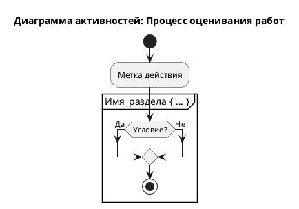

## **1. Общее описание**
Данная диаграмма активностей (UML Activity Diagram) визуализирует последовательность действий и решений в процессе проверки и оценивания студенческих работ. Диаграмма построена с использованием нотации PlantUML.

## **2. Структура диаграммы**

### **2.1 Основные блоки (разделы)**
Диаграмма разделена на четыре логических раздела (partition):

1. **"Проверка работы"** - начальный этап, включающий проверку сроков и оригинальности
2. **"Выставление оценки"** - преобразование баллов в пятибалльную систему
3. **"Документирование"** - фиксация результатов и уведомление
4. **Неявный блок завершения** - обработка результатов и пересдач

### **2.2 Элементы нотации UML**

| Элемент | Описание | Пример в диаграмме |
|---------|----------|-------------------|
| `start` | Начало процесса | `start` |
| `stop` | Конец процесса (полный останов) | `stop` (при плагиате/просрочке) |
| `:Действие:` | Выполняемая операция | `:Студент сдает работу;` |
| `if () then () else ()` | Условный переход | `if (Срок соблюден?)` |
| `partition` | Логическая группа действий | `partition "Проверка работы"` |
| `detach` | Создание отдельного потока | `detach` (для пересдачи) |

## **3. Детальное описание процесса**

### **3.1 Начальный этап**
```
start → :Студент сдает работу;
```

### **3.2 Раздел "Проверка работы"**
```plantuml
if (Срок соблюден?) then (Да)
    :Проверка на плагиат;
    if (Оригинальность > 80%) then (Да)
        :Оценивание по критериям;
        :Определение баллов;
    else (Нет)
        :Обнаружен плагиат;
        stop
    endif
else (Нет)
    :Работа не принимается;
    stop
endif
```

**Критические точки раздела:**
- **Срок сдачи**: работа проверяется на соблюдение дедлайна
- **Порог оригинальности**: 80% - минимальный допустимый уровень
- **Точки останова**: процесс полностью прекращается при:
  - Нарушении срока
  - Обнаружении плагиата

### **3.3 Раздел "Выставление оценки"**
```plantuml
:Конвертация баллов в оценку;
if (Баллы >= 90) then (Отлично)
    :Оценка "5";
elseif (Баллы >= 75) then (Хорошо)
    :Оценка "4";
elseif (Баллы >= 60) then (Удовлетворительно)
    :Оценка "3";
else (Неудовлетворительно)
    :Оценка "2";
endif
```

**Шкала оценивания:**
- **90+ баллов** → Оценка "5" (Отлично)
- **75-89 баллов** → Оценка "4" (Хорошо)
- **60-74 балла** → Оценка "3" (Удовлетворительно)
- **Менее 60 баллов** → Оценка "2" (Неудовлетворительно)

### **3.4 Раздел "Документирование"**
```plantuml
:Запись в журнал;
:Уведомление студента;
:Студент получает результат;
```

### **3.5 Завершающий этап**
```plantuml
if (Оценка < 3) then (Требуется пересдача)
    :Назначение пересдачи;
    detach
else (Работа принята)
    :Завершение процесса;
endif
stop
```

**Особенности завершения:**
- При оценке "2" создается параллельный процесс пересдачи (`detach`)
- Основной поток завершается после фиксации результата

## **4. Потоки выполнения**

### **4.1 Основной успешный поток**
```
Сдача → Проверка сроков → Проверка плагиата → Оценивание → Конвертация → Документирование → Завершение
```

### **4.2 Альтернативные потоки**

| Сценарий | Действия | Результат |
|----------|----------|-----------|
| **Просрочка сдачи** | Проверка сроков → "Нет" | `stop` |
| **Обнаружен плагиат** | Проверка плагиата → "Нет" | `stop` |
| **Неудовлетворительно** | Оценка < 3 → Назначение пересдачи | `detach` → `stop` |

### **4.3 Точки принятия решений**
1. **Срок соблюден?** - бинарное решение
2. **Оригинальность > 80%?** - бинарное решение
3. **Диапазон баллов** - множественный выбор (4 варианта)
4. **Оценка < 3?** - бинарное решение о пересдаче

## **5. Использованные конструкции PlantUML**

### **5.1 Синтаксические конструкции**


### **5.2 Особенности данной диаграммы**
- Использование вложенных условий (nested if)
- Множественные ветвления (`elseif`)
- Сочетание `stop` и `detach` для разных типов завершения
- Русскоязычные метки действий

## **6. Рекомендации по чтению диаграммы**

### **6.1 Последовательность чтения**
1. Начать с элемента `start`
2. Следовать по стрелкам (неявно присутствуют в PlantUML)
3. Обращать внимание на условия в ромбах (решения)
4. Учитывать разделы (partition) для группировки логики

### **6.2 Ключевые проверки**
- **Первая проверка**: соблюдение сроков (строгий критерий)
- **Вторая проверка**: оригинальность работы (порог 80%)
- **Третья проверка**: соответствие баллов шкале оценивания
- **Четвертая проверка**: необходимость пересдачи

## **7. Возможные улучшения диаграммы**

### **7.1 Расширения функционала**
```plantuml
' Пример возможного расширения
:Апелляция оценки;
if (Апелляция принята?) then (Да)
    :Пересмотр оценки;
    :Обновление результата;
else (Нет)
    :Подтверждение исходной оценки;
endif
```

### **7.2 Технические улучшения**
1. Добавление заметок (`note`)
2. Использование цветового кодирования
3. Добавление swimlanes для распределения ролей
4. Включение таймеров для контроля времени

---

## **8. Связь с глоссарием**
Диаграмма использует термины, определенные в глоссарии:
- **Работа**, **Срок сдачи**, **Плагиат**, **Оригинальность**
- **Критерии оценивания**, **Баллы**, **Оценка**
- **Конвертация**, **Журнал**, **Уведомление**, **Пересдача**
- **Преподаватель**, **Студент**

---

**Версия документации**: 1.0  
**Дата создания**: 2024  
**Соответствует диаграмме**: Диаграмма активностей "Процесс оценивания работ" на PlantUML
