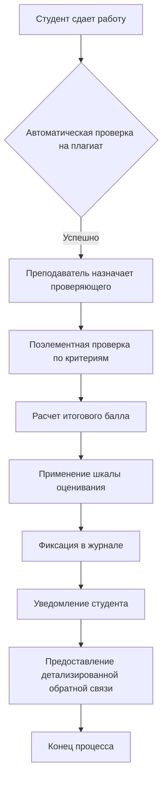

**БИЗНЕС-ТРЕБОВАНИЯ К СИСТЕМЕ ОЦЕНИВАНИЯ УЧЕБНЫХ РАБОТ**

### **1. БИЗНЕС-КОНТЕКСТ И СТРАТЕГИЧЕСКИЕ ЦЕЛИ**

#### **1.1. Бизнес-проблема**
Существующий процесс оценивания характеризуется:
*   Субъективностью оценки из-за отсутствия единых стандартов
*   Задержками в предоставлении обратной связи студентам
*   Рисками ошибок при расчете итоговых оценок
*   Сложностью анализа успеваемости на уровне курса/потока
*   Отсутствием прозрачности критериев для студентов

#### **1.2. Бизнес-цели**
| ID цели | Цель | Метрика успеха | Целевое значение |
|---------|------|----------------|------------------|
| **BG-001** | Повысить объективность оценивания | Коэффициент согласованности оценок между преподавателями | ≥85% |
| **BG-002** | Сократить время обработки работ | Среднее время от сдачи до объявления результата | ≤7 рабочих дней |
| **BG-003** | Увеличить прозрачность процесса | Доля студентов, подтверждающих понимание критериев | ≥90% |
| **BG-004** | Снизить административную нагрузку | Время на ведение журналов | Сокращение на 40% |
| **BG-005** | Улучшить качество обратной связи | Индекс удовлетворенности студентов обратной связью | ≥4.2 из 5 |

### **2. ДЕТАЛИЗИРОВАННЫЕ БИЗНЕС-ПРАВИЛА**

#### **2.1. Правила работы с критериями оценивания**
| ID правила | Название | Детализация | Исключения |
|------------|----------|-------------|------------|
| **BR-101** | Обязательность критериев | Каждая дисциплина должна иметь утвержденные критерии оценивания до начала семестра | Творческие работы могут иметь гибкие критерии по согласованию с методическим советом |
| **BR-102** | Структура критериев | Критерии включают: 1) Категорию, 2) Макс. балл, 3) Описание уровней выполнения, 4) Примеры | - |
| **BR-103** | Валидация критериев | Критерии утверждаются заведующим кафедрой и согласовываются с методистом | - |
| **BR-104** | Доступность критериев | Критерии должны быть опубликованы в LMS не позднее первой лекции | - |
| **BR-105** | Изменение критериев | Изменения в течение семестра допускаются только по решению учебно-методической комиссии | - |

#### **2.2. Правила проверки работ**
| ID правила | Название | Детализация | Ответственный |
|------------|----------|-------------|---------------|
| **BR-201** | Срок проверки | Проверка должна быть завершена в течение 10 рабочих дней с момента сдачи | Преподаватель |
| **BR-202** | Обязательность обратной связи | К каждому критерию должен быть предоставлен комментарий о качестве выполнения | Преподаватель |
| **BR-203** | Детализация баллов | Баллы выставляются с шагом 0.5 в рамках диапазона критерия | Преподаватель |
| **BR-204** | Неизменность критериев | В рамках одной работы критерии не могут меняться после начала проверки | Преподаватель |
| **BR-205** | Проверка на плагиат | Все текстовые работы проходят автоматическую проверку на плагиат перед оценкой | Система |

#### **2.3. Правила работы с оценочной шкалой**
| ID правила | Название | Формула/Логика | Пример |
|------------|----------|----------------|---------|
| **BR-301** | Формат шкалы | Шкала должна быть линейной или нелинейной с явной формулой пересчета | Диапазоны: 0-59=2, 60-74=3, 75-89=4, 90-100=5 |
| **BR-302** | Округление результата | Округление итогового балла производится по математическим правилам (0.5 и выше - вверх) | 89.5 → 90 → оценка 5 |
| **BR-303** | Учет весов | Если работа состоит из частей, должна применяться формула с весами: Σ(балл_i × вес_i) | Теория (40%) + Практика (60%) |
| **BR-304** | Апелляции | Студент имеет право на апелляцию в течение 3 дней после объявления оценки | - |

#### **2.4. Правила фиксации в журнале**
| ID правила | Название | Требования к данным | Сроки |
|------------|----------|---------------------|-------|
| **BR-401** | Полнота записи | Запись должна содержать: ФИО студента, дату сдачи, баллы по критериям, итоговый балл, оценку, дату проверки, ФИО преподавателя | - |
| **BR-402** | Неизменность журнала | После закрытия семестра изменения в журнале возможны только через служебную записку декану | - |
| **BR-403** | Резервное копирование | Ежедневное автоматическое резервное копирование данных журнала | Ежедневно в 23:00 |
| **BR-404** | Доступ к истории | Хранение полной истории изменений каждой оценки в течение 5 лет | - |

### **3. ПОЛНЫЙ БИЗНЕС-ПРОЦЕСС С АЛЬТЕРНАТИВНЫМИ СЦЕНАРИЯМИ**

#### **3.1. Основной сценарий (успешная проверка)**


#### **3.2. Альтернативные сценарии**

**Сценарий А: Обнаружен плагиат**
```
1. Система обнаруживает уровень плагиата >30%
2. Автоматическая блокировка проверки
3. Уведомление преподавателя и методиста
4. Создание служебной записки
5. Рассмотрение дисциплинарной комиссией
6. Возможные исходы:
   а) Разрешение на доработку (плагиат 30-50%)
   б) Нулевая оценка (плагиат 50-70%)
   в) Академическое взыскание (плагиат >70%)
```

**Сценарий Б: Просрочка проверки**
```
1. За 2 дня до дедлайна - уведомление преподавателю
2. В день дедлайна - уведомление заведующему кафедрой
3. Через 3 дня после дедлайна - автоматическое уведомление декану
4. Принудительное назначение другого проверяющего
```

**Сценарий В: Апелляция студента**
```
1. Студент подает апелляцию через LMS (макс. 3 дня)
2. Система автоматически уведомляет преподавателя
3. Преподаватель предоставляет обоснование оценки (2 дня)
4. При недостижении согласия - создание апелляционной комиссии
5. Рассмотрение комиссией (5 рабочих дней)
6. Обязательное исполнение решения комиссии
```

### **4. ТРЕБОВАНИЯ К ДОКУМЕНТАМ И ДАННЫМ**

#### **4.1. Структура документа "Критерии оценивания"**
```yaml
Дисциплина: "Базы данных"
Тип работы: "Курсовой проект"
Максимальный балл: 100

Критерии:
  - Категория: "Теоретическая часть"
    Вес: 30%
    Подкритерии:
      - Полнота освещения темы (0-10 баллов)
        Уровни:
          9-10: Полное освещение всех аспектов
          7-8: Освещены основные аспекты
          5-6: Частичное освещение
          0-4: Неполное освещение
      - Анализ литературы (0-10 баллов)
      - Логичность изложения (0-10 баллов)
  
  - Категория: "Практическая реализация"
    Вес: 50%
    Подкритерии: [...]
  
  - Категория: "Оформление"
    Вес: 20%
    Подкритерии: [...]
```

#### **4.2. Журнал успеваемости - минимальный набор полей**
| Поле | Тип | Обязательное | Описание |
|------|-----|--------------|----------|
| ID_записи | UUID | Да | Уникальный идентификатор |
| ID_студента | Ссылка | Да | Связь с карточкой студента |
| ID_дисциплины | Ссылка | Да | Связь с дисциплиной |
| Тип_работы | Enum | Да | Проект/контрольная/экзамен |
| Дата_сдачи | Date | Да | Дата получения работы |
| Дата_проверки | Date | Да | Дата завершения проверки |
| Баллы_JSON | JSON | Да | Детализированные баллы по критериям |
| Итоговый_балл | Decimal(5,2) | Да | Расчетный итоговый балл |
| Оценка | Integer | Да | Итоговая оценка по шкале |
| Проверяющий | Ссылка | Да | Преподаватель |
| Статус | Enum | Да | На проверке/Проверено/Апелляция |
| Комментарий | Text | Нет | Общий комментарий преподавателя |

### **5. РОЛИ И ПОЛНОМОЧИЯ**

| Роль | Права | Ограничения |
|------|-------|-------------|
| **Студент** | Просмотр критериев, сдача работы, просмотр оценки, подача апелляции | Только свои работы, нет доступа к журналу |
| **Преподаватель** | Проверка работ, выставление оценок, внесение в журнал, просмотр статистики своей группы | Только свои дисциплины и группы |
| **Методист** | Создание/редактирование критериев и шкал, мониторинг сроков проверки | Нет права проверки работ |
| **Заведующий кафедрой** | Утверждение критериев, просмотр статистики по кафедре, перераспределение проверок | - |
| **Деканат** | Просмотр сводных отчетов, экспорт данных для отчетности, архивирование | Нет права изменения исторических данных |
| **Системный администратор** | Техническое обслуживание, резервное копирование, управление доступом | Нет доступа к содержательной части |

### **6. НЕФУНКЦИОНАЛЬНЫЕ ТРЕБОВАНИЯ**

#### **6.1. Производительность**
*   Одновременная сдача работ: до 500 студентов в час
*   Время отклика интерфейса: <2 секунд
*   Время загрузки журнала: <5 секунд при 10к записей

#### **6.2. Безопасность**
*   Аутентификация через единую систему университета (LDAP/Active Directory)
*   Двухфакторная аутентификация для преподавателей
*   Шифрование данных при передаче (TLS 1.3)
*   Шифрование хранимых персональных данных
*   Автоматическое логирование всех действий с оценками

#### **6.3. Надежность**
*   Доступность системы: 99.5% в рабочее время
*   Время восстановления после сбоя: <4 часа
*   Автоматическое сохранение черновиков проверки каждые 5 минут

#### **6.4. Совместимость**
*   Интеграция с LMS университета (Moodle/Blackboard)
*   Поддержка SCORM-пакетов для критериев
*   Экспорт в Excel для отчетности деканата
*   API для интеграции с системой "Электронный университет"

### **7. МЕТРИКИ И ОТЧЕТНОСТЬ**

#### **7.1. Обязательные отчеты**
1. **Отчет о сроках проверки** - по преподавателям и дисциплинам
2. **Статистика успеваемости** - средние баллы, распределение оценок
3. **Анализ объективности** - сравнение оценок разных проверяющих
4. **Отчет по апелляциям** - количество, причины, результаты
5. **Прогресс студента** - динамика по семестрам

#### **7.2. KPI процесса**
*   Процент работ, проверенных в срок: ≥95%
*   Средняя детализация обратной связи: ≥50 слов на работу
*   Количество апелляций: ≤5% от общего числа оценок
*   Время рассмотрения апелляции: ≤5 рабочих дней
*   Удовлетворенность студентов процессом: ≥4.0 из 5

### **8. ПЕРЕХОДНЫЕ ТРЕБОВАНИЯ**

1. **Миграция исторических данных** из старых журналов за последние 3 года
2. **Обучение преподавателей** - 4 часовые сессии на группу
3. **Пилотное внедрение** на 2-3 дисциплинах в течение 1 семестра
4. **Постепенный переход** всех дисциплин в течение учебного года
5. **Техническая поддержка** в режиме 24/7 в первые 3 месяца

---

### **9. ПРИЛОЖЕНИЯ К ТРЕБОВАНИЯМ**

#### **9.1. Глоссарий**
*   **Критерий оценивания** - измеряемый параметр работы с описанием уровней выполнения
*   **Оценочная шкала** - правила перевода баллов в итоговую оценку
*   **Детализированная обратная связь** - комментарии по каждому критерию с примерами
*   **Апелляция** - официальный запрос на пересмотр оценки

#### **9.2. Связанные процессы**
1. Учебный процесс планирования дисциплин
2. Процесс защиты выпускных квалификационных работ
3. Процесс академической аттестации студентов
4. Процесс формирования учебной нагрузки преподавателей

---

**Статус документа**: Черновик для обсуждения  
**Целевая аудитория**: Руководство факультета, методисты, ИТ-отдел  
**Дата следующего пересмотра**: 01.09.2024
